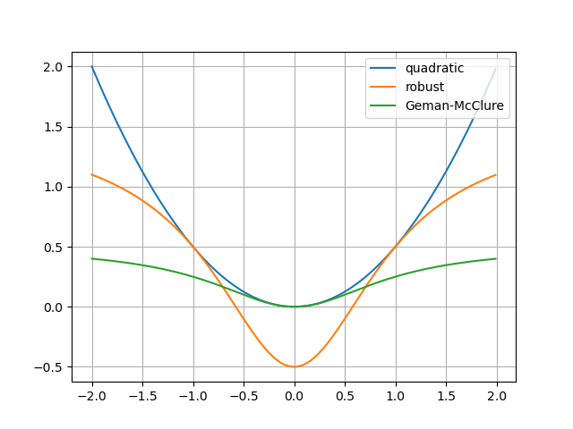
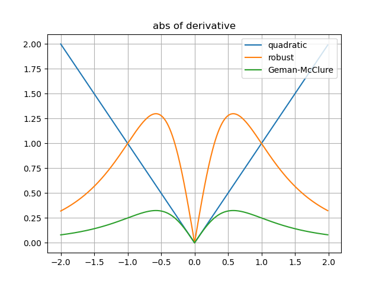
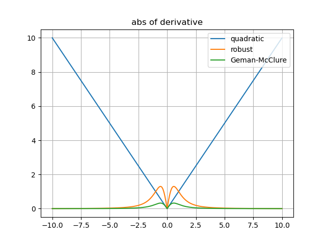

#机器人中的状态估计课后习题答案  
#### 完成人：高明
#### 联系方式：
     知乎：高明  
     微信：gaoming0901  

# 2.概率论基础

## 2.5.1 
假设$u$,$v$是相同维度向量, 请证明下面等式：   $u^{T}v=tr(vu^{T})$  

**solution:**  
$u=(x_{1},x_{2},...,x_{n})^{T}$  

$v=(y_{1},y_{2},...,y_{n})^{T}$  

$u^{T}v=x_{1}y_{1}+x_{2}y_{2}+...+x_{n}y_{n}$  $=\sum_{i=1}^{n}{x_{i}y_{i}}$  

$uv^{T}=$$
\left[
\begin{matrix}
 x_{1}y_{1}      & \cdots      & \cdots & \cdots      \\
 \cdots      & x_{2}y_{2}      & \cdots & \cdots      \\
 \vdots & \vdots & \ddots & \vdots \\
 \cdots      & \cdots      & \cdots & x_{n}y_{n}      \\
\end{matrix}
\right]$  

$tr(uv^{T})=\sum_{i=1}^{n}x_{i}y_{i}=u^{T}v$

## 2.5.2
如果有两个相互独立的随机变量$x$,$y$,它们的联合分布为$p(x,y)$,请证明它们概率的香浓信息等于各自独立香浓信息的和:  

$H(x,y)=H(x)+H(y)$  

**solution:**  

$H(x,y)$  

$=-E_{(x,y)}(ln(f(x,y)))$  

$=-\int_{-\infty}^{\infty}\int_{-\infty}^{\infty}f(x,y)ln(f(x,y))dxdy$  

因为$x$,$y$独立  

$H(x,y)$  
$=-\int_{-\infty}^{\infty}\int_{-\infty}^{\infty}f(x)f(y)[ln(f(x))+ln(f(y))]dxdy$  

$=-[\int_{-\infty}^{\infty}(f(x)ln(f(x))dx]*\int_{-\infty}^{\infty}f(y)dy-[\int_{-\infty}^{\infty}f(y)ln(f(y))dy]*\int_{-\infty}^{\infty}f(x)dx$  

$=-\int_{-\infty}^{\infty}(f(x)ln(f(x))dx-\int_{-\infty}^{\infty}f(y)ln(f(y))dy$  

$=H(x)+H(y)$  

## 2.5.3
对于高斯分布的随机变量，$x$~N($\mu$,$\Sigma$),请证明下面的等式：  

$\mu=E[xx^{T}]=\Sigma+\mu\mu^{T}$  

**solution:**  

$\Sigma$   
$=E[(x-\mu)(x-\mu)^{T}]$  

$=E(xx^{T}-x\mu^{T}-\mu x^{T}+\mu\mu^{T})$  

$=E(xx^{T})-E(x)\mu^{T}-\mu E(x^{T})+\mu \mu^{T}$  

因为$E(x)=\mu$  

$\Sigma=E(xx^{T})-\mu \mu^{T}$

因此

$E(xx^{T})=\Sigma+\mu \mu^{T}$

## 2.5.4
对于高斯分布的随机变量，x~N($\mu$,$\Sigma$),请证明下面的等式：

$\mu=E(x)=\int_{-\infty}^{\infty}xp(x)dx$  

**solution:**  

$E(x)$  

$=\int_{-\infty}^{\infty}\frac{x}{{\sqrt{(2 \pi)^{N}}det(\Sigma)}}exp(-\frac{1}{2}(x-\mu)^{T}\Sigma^{-1}(x-\mu))dx$

做变换：  
$y=x-\mu$  

可得:
$x=y+\mu$  

$E(x)$  

$=\int_{-\infty}^{\infty}\frac{y+ \mu}{\sqrt{(2\pi)^{N}det(\Sigma)}}exp(-\frac{1}{2}y^{T}\Sigma^{-1}y)dy$  

$=\int_{-\infty}^{\infty}\frac{y}{\sqrt{(2\pi)^{N}det(\Sigma)}}exp(-\frac{1}{2}y^{T}\Sigma^{-1}y)dy +\int_{-\infty}^{\infty}\frac{\mu}{\sqrt{(2\pi)^{N}det(\Sigma)}}exp(-\frac{1}{2}y^{T}\Sigma^{-1}y)dy$   

上式第一项由于奇函数在关于0对称空间积分为0  

上式第二项扣除$\mu$满足概率归一化条件 

$E(x)=\mu$

## 2.5.5
对于高斯分布的随机变量，$x$~$N(\mu,\Sigma)$,证明下式：

$\Sigma=E[(x-\mu)(x- \mu)^{T}]=\int_{-\infty}^{\infty}(x-\mu)(x-\mu)^{T}p(x)dx$  

**solution:**  

$E[(x-\mu)(x- \mu)^{T}]$  

$=\int_{-\infty}^{\infty}\frac{(x-\mu)(x-\mu)^{T}}{{\sqrt{(2 \pi)^{N}}det(\Sigma)}}exp(-\frac{1}{2}(x-\mu)^{T}\Sigma^{-1}(x-\mu))dx$  

做代换$y=x-\mu$  

$E[(x-\mu)(x- \mu)^{T}]$  

$=\int_{-\infty}^{\infty}\frac{yy^{T}}{{\sqrt{(2 \pi)^{N}}det(\Sigma)}}exp(-\frac{1}{2}(y^{T}\Sigma^{-1}y))dy..................<0>$  

下面参考文献【1】中公式(108)如下式：  

$\frac{\partial}{\partial{X}}(X^{T}BX)=BX+B^{T}X$  

上式中X是矩阵，向量算特殊矩阵，直接带入，向量表达式如下：  

$\frac{d}{d{x}}(x^{T}Bx)=Bx+B^{T}x.........................................<1>$  

由于协方差矩阵是对称矩阵，根据等式$<1>$:

$\frac{d}{d{x}}(x^{T}\Sigma^{-1} x)=\Sigma^{-1}*x+\Sigma^{-T}*x=2*\Sigma^{-1} *x.....<2>$ 

对于<2>式变换：

$\frac{d}{d{x}}(-\frac{1}{2}x^{T}\Sigma^{-1} x)=(-\frac{1}{2})(\Sigma^{-1}*x+\Sigma^{-T}*x)=\Sigma^{-1} *x$  

$=x^{T}\Sigma^{-1}................................................................<3>$  

将<3>式带入<0>式：

$E[(x-\mu)(x- \mu)^{T}]$  

$=\int_{-\infty}^{\infty}\frac{-y*\Sigma}{{\sqrt{(2 \pi)^{N}}det(\Sigma)}}exp(-\frac{1}{2}(y^{T}\Sigma^{-1}y))d(-\frac{1}{2}(y^{T}\Sigma^{-1}y))$  

$=\int_{-\infty}^{\infty}\frac{-y*\Sigma}{{\sqrt{(2 \pi)^{N}}det(\Sigma)}}d(exp(-\frac{1}{2}(y^{T}\Sigma^{-1}y))$  

分步积分法：

$E[(x-\mu)(x- \mu)^{T}]$  

$=\frac{y*\Sigma}{{\sqrt{(2 \pi)^{N}}det(\Sigma)}}*exp(-\frac{1}{2}(y^{T}\Sigma^{-1}y))|_{-\infty}^{+\infty}+\int_{-\infty}^{\infty}\frac{\Sigma}{{\sqrt{(2 \pi)^{N}}det(\Sigma)}}exp(-\frac{1}{2}(y^{T}\Sigma^{-1}y))dy$   

$=0+ \Sigma$  

$=\Sigma$

## 2.5.6
对于K个相互独立的高斯变量，$x_{k}$~$N(\mu_{k},\Sigma_{k})$,请证明它们的归一化积仍然是高斯分布： 

$$exp(-\frac{1}{2}(x-\mu)^{T}\Sigma^{-1}(x-\mu)\equiv \eta \prod_{k=1}^{K}exp(-\frac{1}{2}(x_{k}-\mu_{k})^{T}\Sigma_{k}^{-1}(x_{k}-\mu_{k})) $$  

其中：  
$$\Sigma^{-1}=\sum_{k=1}^{K}\Sigma_{k}^{-1}$$  
$$\Sigma^{-1} \mu=\sum_{k=1}^{K} \Sigma_{k}^{-1} \mu_{k}$$  

且$\eta$归一化因子。

**solution:** 

随机变量$x_{k}$的概率密度函数如下：  

$f_{k}(x)=\frac{1}{\sqrt{(2 \pi)^{N_{k}}}det(\Sigma_{k}^{-1})}exp(-\frac{1}{2}(x-\mu_{k})^{T}\Sigma_{k}^{-1}(x-\mu_{k}))$  

$f_{1}(x)*f_{2}(x)*...*f_{K}(x)$  

$=\frac{1}{\sqrt{(2 \pi)^{\sum_{k=1}^{K}N_{k}}}\prod_{k=1}^{K}det(\Sigma_{k})}exp(-\frac{1}{2} \sum_{k=1}^{K}(x-\mu_{k})^{T}\Sigma_{k}^{-1}(x-\mu))$  

将指数部分的求和号展开：  

$f_{1}(x)*f_{2}(x)*...*f_{K}(x)$  

$=\frac{1}{\sqrt{(2 \pi)^{\sum_{k=1}^{K}N_{k}}}\prod_{k=1}^{K}det(\Sigma_{k})}exp(-\frac{1}{2} (x^{T}(\sum_{k=1}^{K}\Sigma_{k}^{-1})x-(\sum_{k=1}^{K}\mu_{k}^{T}\Sigma_{k}^{-1})x-x^{T}\sum_{k=1}^{K}\Sigma_{i}^{-1}\mu_{i}+\sum_{k=1}^{K}\mu_{k}^{T}\Sigma_{k}^{-1}\mu_{k}))....................................................<0>$  

因为协方差矩阵是对称矩阵，<0>式中
$(\sum_{k=1}^{K}\mu_{k}^{T}\Sigma_{k}^{-1})x=x^{T}\sum_{k=1}^{K}\Sigma_{i}^{-1}\mu_{i}$

因此：  

$f_{1}(x)*f_{2}(x)*...*f_{K}(x)$  

$=\frac{1}{\sqrt{(2 \pi)^{\sum_{k=1}^{K}N_{k}}}\prod_{k=1}^{K}det(\Sigma_{k})}exp(-\frac{1}{2} (x^{T}(\sum_{k=1}^{K}\Sigma_{k}^{-1})x-2x^{T}\sum_{k=1}^{K}\Sigma_{i}^{-1}\mu_{i}+\sum_{k=1}^{K}\mu_{k}^{T}\Sigma_{k}^{-1}\mu_{k})).....................<1>$  

在式<1>中：
$x^{T}(\sum_{k=1}^{K}\Sigma_{k}^{-1})x$为二次项  
$2x^{T}\sum_{k=1}^{K}\Sigma_{i}^{-1}\mu_{i}$为一次项  
可以凑出“完全平方形式”

$f_{1}(x)*f_{2}(x)*...*f_{K}(x)$  

$=\frac{1}{\sqrt{(2 \pi)^{\sum_{k=1}^{K}N_{k}}}\prod_{k=1}^{K}det(\Sigma_{k})}exp(-\frac{1}{2}(x-\mu)^{T}\Sigma^{-1}(x-\mu)+M)$  

上式中M为一个常数;

$f_{1}(x)*f_{2}(x)*...*f_{K}(x)$  

$=\frac{1}{\sqrt{(2 \pi)^{\sum_{k=1}^{K}N_{k}}}\prod_{k=1}^{K}det(\Sigma_{k})}exp(-\frac{1}{2}(x-\mu)^{T}\Sigma^{-1}(x-\mu))*exp(M).....................................................................<2>$

根据上式二次项一次项对应参数，可以得到：

$$\Sigma^{-1}=\sum_{k=1}^{K}\Sigma_{k}^{-1}$$  
$$\Sigma^{-1} \mu=\sum_{k=1}^{K} \Sigma_{k}^{-1} \mu_{k}$$  

为了满足归一化条件，需要将变量指数项外的其他常数项归一到$\eta$中，也即证明K个独立正态分布随机变量概率密度相乘归一化之后仍为正态分布  

## 2.5.7
假设有K个互相独立的随机变量$x_{k}$,它们通过加权组成一个新的随机变量：
$$x=\sum_{k=1}^{K}\omega_{k}x_{k}$$  

其中$\sum_{k=1}^{K}\omega_{k}=1$且$\omega_{k}\geq 0$,它们的期望表示为：
$$\mu=\sum_{k=1}^{K}\omega_{k}\mu_{k}$$  
其中$\mu_{k}$是x_{k}的均值，请定义出一个计算方差的表达式，注意，这些随机变量并没有假设服从高斯分布  

**solution:** 

统计学上有公式：  

对于独立随机变量$X,Y$  

$D(\omega_{x}X+\omega_{y}Y)=\omega_{x}^{2}D(X)+\omega_{y}^{2}D(Y).....<0>$  

这里假设$x_{k}$的方差为$\sigma_{k}^{2}$  

则方差的计算公式为：  

$\sigma^{2}=\sum_{i=1}^{K}\omega_{k}^{2} \sigma_{k}^{2}$  

$其中\sum_{k=1}^{K}\omega_{k}=1$

## 2.5.8
当K维随机变量x服从标准正态分布，即x~N($0$,$1$),则随机变量：  
$$y=x^{T}x$$
服从自由度为K的卡方分布，请证明该随机变量的均值为K，方差为2K(**题目条件暗含每一维度随机变量独立同分布假设，远书为准确提及**)

**solution:** 

$y=x_{1}^{2}+x_{2}^{2}+...+x_{K}^{2}$ 

$E(y)=E(x_{1}^{2}+x_{2}^{2}+...+x_{K}^{2})$  

$=E(x_{1}^{2})+E(x_{2}^{2})+...+E(x_{K}^{2})$

根据统计学：

$E(X^{2})=D(X)+(E(X))^{2}$  

因此对于任意$1 \leq i\leq K:$  

$E(x_{k}^{2})=1+0=1$  

$E(y)=K$

根据Isserlis定理：
$E\left[x_{i} x_{j} x_{k} x_{\ell}\right]=E\left[x_{i} x_{j}\right] E\left[x_{k} x_{\ell}\right]+E\left[x_{i} x_{k}\right] E\left[x_{j} x_{\ell}\right]+E\left[x_{i} x_{\ell}\right] E\left[x_{j} x_{k}\right]..............................<0>$  

方差：  

$D(y)$  

$=E((x_{1}^{2}+x_{2}^{2}+...x_{K}^{2})^{2})$  

$=E(\sum_{i=1}^{K}x_{i}^{4})+2E(\sum_{i=1,j=1,i \ne j}^{K}E(x_{i}^{2}x_{j}^{2}))............<1>$  

根据<0>,其中：  

$E(\sum_{i=1}^{K}x_{i}^{4})$  

$=\sum_{i=1}^{K}E(x_{i}^{4})$  

$=3K$  

$E(\sum_{i=1,j=1,i \ne j}^{K}E(x_{i}^{2}x_{j}^{2}))$  

$=\frac{K(K-1)}{2}$  

将上述两式带入<0>:  

$D(y)=2K$

# 线性高斯系统估计

## 3.6.1

考虑时间离散系统：  
$$x_{k}=x_{k-1}+v_{k}+\omega_{k},\omega服从N(0,Q)正态分布$$

$$y_{k}=x_{k}+n_{k},n_{k}服从N(0.R)正态分布$$

这可以表达一辆沿x轴前进或者后退的汽车，初始状态$\check{x}_{0}$未知，请建立批量最小二乘的状态估计方程：
$$(H^{T}W^{-1}H) \hat{x}=H^{T}W^{-1}z$$  
即推导出$H,W,z$和$\hat{x}$的详细形式。令最大时间步数为$K=5$,并假设所有噪声互相无关，该问题存在唯一解吗？  

**solution:**  

本题思路：根据(3.40)的做法，因为没有初始状态的先验，因此将初始状态项在计算中全部略去，也就是删除矩阵中对应的行、块。  

根据已知条件任意时刻$A_{k=0,1,2,3,4}=1，C_{k=0,1,2,3,4,5}=1$

根据公式(3.12)：  

$$z=
\left[
\begin{matrix}
 v_{1}     \\
 v_{2}     \\
 v_{3}     \\
 v_{4}     \\
 v_{5}     \\
 y_{0}     \\
 y_{1}     \\
 y_{2}     \\
 y_{3}     \\
 y_{4}     \\
 y_{5}     \\
\end{matrix}
\right]$$  

这里删除了初始状态项，但是保留了初始时刻的观测$y_{0}$,因为机器人可以在不知道自己初始位置的条件下，进行观测  

同样的方法，根据式(3.13b):

$$W=
\left[
\begin{matrix}
 &Q_{1}     &0  &0 &0 &0 &0 &0 &0 &0 &0 &0  \\
 &0     &Q_{2}  &0 &0 &0 &0 &0 &0 &0 &0 &0  \\
 &0     &0  &Q_{3} &0 &0 &0 &0 &0 &0 &0 &0  \\
 &0     &0  &0 &Q_{4} &0 &0 &0 &0 &0 &0 &0  \\
 &0     &0  &0 &0 &Q_{5} &0 &0 &0 &0 &0 &0  \\
 &0     &0  &0 &0 &0 &R_{0} &0 &0 &0 &0 &0  \\
 &0     &0  &0 &0 &0 &0 &R_{1} &0 &0 &0 &0  \\
 &0     &0  &0 &0 &0 &0 &0 &R_{2} &0 &0 &0  \\
 &0     &0  &0 &0 &0 &0 &0 &0 &R_{3} &0 &0  \\
 &0     &0  &0 &0 &0 &0 &0 &0 &0 &R_{4} &0  \\
 &0     &0  &0 &0 &0 &0 &0 &0 &0 &0 &R_{5}  \\
\end{matrix}
\right]$$

也即：  

$W=diag(Q_{1},Q_{2},Q_{3},Q_{4},Q_{5},R_{0},R_{1},R_{2},R_{3},R_{4},R_{5})$  

因此其逆矩阵：  

$W^{-1}=diag(Q_{1}^{-1},Q_{2}^{-1},Q_{3}^{-1},Q_{4}^{-1},Q_{5}^{-1},R_{0}^{-1},R_{1}^{-1},R_{2}^{-1},R_{3}^{-1},R_{4}^{-1},R_{5}^{-1})$

根据(3.32),(3.33)---相对原书中公式需要删除初始状态对应那一列数据:  

$H$
$ =$$
\left[
\begin{matrix}
 &A^{-1}\\
 &C
\end{matrix}
\right]$  

$ =$$
\left[
\begin{matrix}
&1 &0 &0 &0 &0 \\
&-A_{1} &1 &0 &0 &0 \\
&0 &-A_{2} &1 &0 &0 \\
&0 &0 &-A_{3} &1 &0 \\
&0 &0 &0 &-A_{4} &1 \\
&0 &0 &0 &0 &0      \\
&R_{1} &0 &0 &0 &0  \\
&0 &R_{2} &0 &0 &0  \\
&0 &0 &R_{3} &0 &0  \\
&0 &0 &0 &R_{4} &0  \\
&0 &0 &0 &0 &R_{5}  \\
\end{matrix}
\right]$  

因此：  

$H^{T}W^{-1}H$
$=
$$
\left[
\begin{matrix}
&Q_{1}^{-1}+Q_{2}^{-1} &-Q_{2}^{-1} &0 &0 &0 \\
&-Q_{2}^{-1} &Q_{2}^{-1}+Q_{3}^{-1}+R_{2}^{-1} &-Q_{3}^{-1} &0 &0 \\
&0 &-Q_{3}^{-1} &Q_{3}^{-1}+Q_{4}^{-1}+R_{3}^{-1} &-Q_{4}^{-1} &0 \\
&0 &0 &-Q_{4}^{-1} &Q_{4}^{-1}+Q_{5}^{-1}+R_{4}^{-1} &-Q_{5}^{-1} \\
&0 &0 &0 &-Q_{5}^{-1} &Q_{5}^{-1}+R_{5}^{-1} \\
\end{matrix}
\right]$  

$=
$$
\left[
\begin{matrix}
&2Q^{-1} &-Q^{-1} &0 &0 &0 \\
&-Q^{-1} &2Q^{-1}+R^{-1} &-Q^{-1} &0 &0 \\
&0 &-Q^{-1} &2Q^{-1}+R^{-1} &-Q^{-1} &0 \\
&0 &0 &-Q^{-1} &2Q^{-1}+R^{-1} &-Q^{-1} \\
&0 &0 &0 &-Q^{-1} &Q^{-1}+R^{-1} \\
\end{matrix}
\right]$  

$Q>0,R>0$

$W^{-1}$对称且正定，根据(3.37)做修改，因为删除了初始状态，只需：
$rank(H^{T}H)=rank(H^{T})=NK=5就可以构成唯一解充分条件$
显然满足条件  
因此，该系统存在唯一解

## 3.6.2
使用第一题的系统，令$Q=R=1$,证明：
$$\mathbf{H}^{T} \mathbf{W}^{-1} \mathbf{H}=\left[\begin{array}{rrrrr}
2 & -1 & 0 & 0 & 0 \\
-1 & 3 & -1 & 0 & 0 \\
0 & -1 & 3 & -1 & 0 \\
0 & 0 & -1 & 3 & -1 \\
0 & 0 & 0 & -1 & 2
\end{array}\right]$$  
此时Cholesky因子是什么，才能满足$LL^{T}=H^{T}W^{-1}H$?

**solution:**  

证明只需将数据代入上一题目的公式中即可  

这里假设：  

$L=
$$
\left[
\begin{matrix}
&L_{1} &0 &0 &0 &0 \\
&L_{21} &L_{2} &0 &0 &0 \\
&0 &L_{32} &L_{3} &0 &0 \\
&0 &0 &L_{43} &L_{4} &0 \\
&0 &0 &0 &L_{54} &L_{5} \\
\end{matrix}
\right]$  

在本问题中，L矩阵的中的每一项都是标量(0维张量)，因此：  

$L^{T}=
$$
\left[
\begin{matrix}
&L_{1} &L_{21} &0 &0 &0 \\
&0 &L_{2} &L_{32} &0 &0 \\
&0 &0 &L_{3} &L_{43} &0 \\
&0 &0 &0 &L_{4} &L_{54} \\
&0 &0 &0 &0 &L_{5} \\
\end{matrix}
\right]$  

将矩阵相乘：  

$LL^{T}=
$$
\left[
\begin{matrix}
&L_{1}^{2} &L_{1}L_{21} &0 &0 &0 \\
&L_{1}L_{21} &L_{2}^{2}+L_{21}^{2} &L_{2}L_{32} &0 &0 \\
&0 &L_{2}L_{32} &L_{3}^{2}+L_{32}^{2} &L_{3}L_{43} &0 \\
&0 &0 &L_{3}L_{43} &L_{4}^{2}+L_{43}^{2} &L_{4}L_{54} \\
&0 &0 &0 &L_{4}L_{54} &L_{5}^{2}+L_{54}^{2} \\
\end{matrix}
\right]$

从矩阵最左边开始迭代就可以结算处$L$(注意这个矩阵元素的结算因为涉及多个开方，存在多个解，这里仅给出一个):  

$L=
$$
\left[
\begin{matrix}
&\sqrt{2} &0 &0 &0 &0 \\
&-\sqrt{\frac{1}{2}} &\sqrt{\frac{5}{2}} &0 &0 &0 \\
&0 &-\sqrt{\frac{2}{5}} &\sqrt{\frac{13}{5}} &0 &0 \\
&0 &0 &-\sqrt{\frac{5}{13}} &\sqrt{\frac{34}{13}} &0 \\
&0 &0 &0 &-\sqrt{\frac{13}{34}} &\sqrt{\frac{55}{34}} \\
\end{matrix}
\right]$  

## 3.6.3
使用第一题的系统，修改最小二乘解，假设噪声之间存在相关性：  

$$E\left[y_{k} y_{\ell}\right]=\left\{\begin{array}{l}
R \quad|k-\ell|=0 \\
R / 2|k-\ell|=1 \\
R / 4|k-\ell|=2 \\
0 \quad \text { otherwise }
\end{array}\right.$$

此时存在唯一的最小二乘解吗？

**solution:**  

$$W=
\left[
\begin{matrix}
 &Q     &0  &0 &0 &0 &0 &0 &0 &0 &0 &0  \\
 &0     &Q  &0 &0 &0 &0 &0 &0 &0 &0 &0  \\
 &0     &0  &Q &0 &0 &0 &0 &0 &0 &0 &0  \\
 &0     &0  &0 &Q &0 &0 &0 &0 &0 &0 &0  \\
 &0     &0  &0 &0 &Q &0 &0 &0 &0 &0 &0  \\
 &0     &0  &0 &0 &0 &R &R/2 &R/4 &0 &0 &0  \\
 &0     &0  &0 &0 &0 &R/2 &R &R/2 &R/4 &0 &0  \\
 &0     &0  &0 &0 &0 &R/4 &R/2 &R &R/2 &R/4 &0  \\
 &0     &0  &0 &0 &0 &0 &R/4 &R/2 &R &R/2 &R/4  \\
 &0     &0  &0 &0 &0 &0 &0 &R/4 &R/2 &R &R/2  \\
 &0     &0  &0 &0 &0 &0 &0 &0 &R/4 &R/2 &R  \\
\end{matrix}
\right]$$  

等价于  

$W=
\left[
\begin{matrix}
 &Q     &0\\
 &0     &R^{*}
\end{matrix}
\right]$

其中：

$R^{*}=R\left[
\begin{matrix}
 &1     &1/2    &1/4   &0    &0    &0    \\
 &1/2   &1      &1/2   &1/4  &0    &0    \\
 &1/4   &1/2    &1     &1/2  &1/4  &0    \\
 &0     &1/4    &1/2   &1    &1/2  &1/4  \\
 &0     &0      &1/4   &1/2  &1    &1/2  \\
 &0     &0      &0     &1/4  &1/2  &1    \\
\end{matrix}
\right]$

$R^{*}$可逆  

因此$W^{-1}$存在  

根据(3.37):

$rank(H^{T}H)=rank(H^{T})=NK=5$  

存在唯一解

## 3.6.4
使用第一题的系统，推导卡尔曼滤波器的详细过程。本例的初始状态均值为$\check{x}_{0}$方差为$\check{P}_{0}$,证明：稳态时先验和后验方差$\check{P}$和$\hat{P}$,当$K \rightarrow \infty$为以下两个方程组的解：  
$\check{P}^{2}-Q \check{P}-QR=0$
$\hat{P}^{2}+Q\hat{P}-QR=0$  

此二式是离散Riccati方程的两个不同版本，同时，解释为什么这两个二次方程仅有一个是物理上可行的。

**solution:** 

具有先验信息的条件下：

$H^{T}W^{-1}H$
$=
$$
\left[
\begin{matrix}
&\check{P}_{0}^{-1}+Q^{-1}+R^{-1}  &-Q^{-1}  &0  &0   &0   &0\\
&-Q^{-1}   &2Q^{-1}+R^{-1}  &-Q^{-1}  &0  &0  &0\\
&0  &-Q^{-1}  &2Q^{-1}+R^{-1}  &-Q^{-1}  &0  &0\\
&0  &0 &-Q^{-1}  &2Q^{-1}+R^{-1}  &-Q^{-1}  &0 \\
&0  &0 &0 &-Q^{-1}  &2Q^{-1}+R^{-1}  &-Q^{-1} \\
&0  &0  &0  &0 &-Q^{-1}  &Q^{-1}+R^{-1} \\
\end{matrix}
\right]$  

$L=
$$
\left[
\begin{matrix}
&L_{0} &0 &0 &0 &0 &0 \\
&L_{10} &L_{1} &0 &0 &0 &0 \\
&0 &L_{21} &L_{2} &0 &0 &0 \\
&0 &0 &L_{32} &L_{3} &0 &0 \\
&0 &0 &0 &L_{43} &L_{4} &0 \\
&0 &0 &0 &0 &L_{54} &L_{5} \\
\end{matrix}
\right]$  

$L^{T}=
$$
\left[
\begin{matrix}
&L_{0}^{T} &L_{10}^{T} &0 &0 &0 &0 \\
&0 &L_{1}^{T} &L_{21}^{T} &0 &0 &0 \\
&0 &0 &L_{2}^{T} &L_{32}^{T} &0 &0 \\
&0 &0 &0 &L_{3}^{T} &L_{43}^{T} &0 \\
&0 &0 &0 &0 &L_{4}^{T} &L_{54}^{T} \\
&0 &0 &0 &0 &0 &L_{5}^{T} \\
\end{matrix}
\right]$  

$=
$$
\left[
\begin{matrix}
&L_{0} &L_{10} &0 &0 &0 &0 \\
&0 &L_{1} &L_{21} &0 &0 &0 \\
&0 &0 &L_{2} &L_{32} &0 &0 \\
&0 &0 &0 &L_{3} &L_{43} &0 \\
&0 &0 &0 &0 &L_{4} &L_{54} \\
&0 &0 &0 &0 &0 &L_{5} \\
\end{matrix}
\right]$  

对于：  

$\begin{aligned}
(k=1 \ldots K) & \\
\mathbf{L}_{k-1} \mathbf{L}_{k-1}^{T}=& \mathbf{I}_{k-1}+\mathbf{A}_{k-1}^{T} \mathbf{Q}_{k}^{-1} \mathbf{A}_{k-1} \\
\mathbf{L}_{k-1} \mathbf{d}_{k-1}=& \mathbf{q}_{k-1}-\mathbf{A}_{k-1}^{T} \mathbf{Q}_{k}^{-1} \mathbf{v}_{k} \\
\mathbf{L}_{k, k-1} \mathbf{L}_{k-1}^{T}=&-\mathbf{Q}_{k}^{-1} \mathbf{A}_{k-1} \\
\mathbf{I}_{k}=&-\mathbf{L}_{k, k-1} \mathbf{L}_{k, k-1}^{T}+\mathbf{Q}_{k}^{-1}+\mathbf{C}_{k}^{T} \mathbf{R}_{k}^{-1} \mathbf{C}_{k} \\
\mathbf{q}_{k}=&-\mathbf{L}_{k, k-1} \mathbf{d}_{k-1}+\mathbf{Q}_{k}^{-1} \mathbf{v}_{k}+\mathbf{C}_{k}^{T} \mathbf{R}_{k}^{-1} \mathbf{y}_{k}
\end{aligned}$

根据本系统修正：

$\begin{aligned}
(k=1 \ldots K) & \\
\mathbf{L}_{k-1} \mathbf{L}_{k-1}=& \mathbf{I}_{k-1}+ \mathbf{Q}^{-1}  \\
\mathbf{L}_{k-1} \mathbf{d}_{k-1}=& \mathbf{q}_{k-1}-\mathbf{Q}^{-1} \mathbf{v}_{k} \\
\mathbf{L}_{k, k-1} \mathbf{L}_{k-1}=&-\mathbf{Q}^{-1} \\
\mathbf{I}_{k}=&-\mathbf{L}_{k, k-1} \mathbf{L}_{k, k-1}+\mathbf{Q}^{-1}+ \mathbf{R}^{-1} \\
\mathbf{q}_{k}=&-\mathbf{L}_{k, k-1} \mathbf{d}_{k-1}+\mathbf{Q}^{-1} \mathbf{v}_{k}+\mathbf{C}^{T} \mathbf{R}^{-1} \mathbf{y}_{k}
\end{aligned}$

$\begin{aligned}
\mathbf{I}_{0} &=\check{\mathbf{P}}_{0}^{-1}+ \mathbf{R}^{-1}  \\
\mathbf{q}_{0} &=\check{\mathbf{P}}_{0}^{-1} \check{\mathbf{x}}_{0}+\mathbf{R}^{-1} \mathbf{y}_{0} \\
\hat{\mathbf{x}}_{K} &=\mathbf{L}_{K}^{-1} \mathbf{d}_{K}
\end{aligned}$

卡尔曼滤波推导完毕

根据(3.28)

当$K \rightarrow \infty$处于稳态时：  

$\check{P} = \hat{P} + Q -------------<0>$  

$K =\check { P } (\check{P} +R)^{-1}----------<1>$  

$\hat{P} = (1-K) \check{P} -------------<2>$

将<1><2>带入<0>:  
$\check{P}=(1-K)\check{P}+Q=(1-\frac{\check{P}}{\check{P}+R})\check{P}+Q$  

整理得：  
$\check{P}^{2}-Q \check{P}-QR=0$  

将<0><1>带入<2>得：  
$\hat{P}=(1-K)(\hat{P}+Q)=(1-\frac{\hat{P}+Q}{\hat{P}+Q+R})(\hat{P}+Q)$  

整理得：  
$\hat{P}^{2}+Q\hat{P}-QR=0$  

## 3.6.5
使用3.3.2节的MAP方法，推导后向的卡尔曼滤波器(而非前向的)

**solution:** 

反向卡尔曼滤波应该是在得到$k$时刻的控制和观测之后，对$K-1$时刻的状态进行估计  

根据(3.109)式，也即计算$\hat{x}_{k-1}^{'}$  

原理示意图参考书中3-4图  

根据(3.110):  

$(\hat{P}_{k-1}^{-1}+A_{k-1}^{T}Q_{k}^{-1}A_{k-1}) \hat{x}_{k-1}^{'} -A_{k-1}^{T}Q_{k}^{-1} \hat{x}_{k} =\hat{P}_{k-1}^{-1} \hat{x}_{k-1}-A_{k-1}^{T}Q_{k}^{-1}v_{k} ------<0>$

根据正向卡尔曼滤波器的递推公式(3.120):  

带入(3.120a)(3.120b)(3.120c)(3.120e)式：

$(\hat{P}_{k-1}^{-1}+A_{k-1}^{T}Q_{k}^{-1}A_{k-1}) \hat{x}_{k-1}^{'} =A_{k-1}^{T}Q_{k}^{-1} \hat{x}_{k} +\hat{P}_{k-1}^{-1} \hat{x}_{k-1}-A_{k-1}^{T}Q_{k}^{-1}v_{k} $

$=A_{k-1}^{T}Q_{k}^{-1}A_{k-1}y_{k}-A_{k-1}^{T}Q_{k}^{-1}A_{k-1}C_{k}v_{k}+A_{k-1}^{T}Q_{k}^{-1}(1-K_{k}C_{k})A_{k-1}\hat{x}_{k-1}$

令：  

$K_{k,b}=(\hat{P}_{k-1}^{-1}+A_{k-1}^{T}Q_{k}^{-1}A_{k-1})^{-1}A_{k-1}^{T}Q_{k}^{-1}$  
$K_{k,b,y}=K_{k,b}K_{k}$  
$K_{k,b,v}=-K_{k,b}K_{k}C_{k}$  
$K_{k,b,x}=K_{k,b}(1-K_{k}C_{k})A_{k-1}$

由此反向卡尔曼滤波：  
$\hat{x}_{k-1}^{'}=K_{k,b,y}y_{k}+K_{k,b,v}v_{k}+K_{k,b,x} \hat{x}_{k-1}$  

上式中$y_{k},v_{k}$融合了k时刻的观测和控制  
$\hat{x}_{k-1}$融合了0 ~ k-1时刻的信息  

## 3.5.6
证明：  
$\left[\begin{array}{cccccc}
\mathbf{1} & & & & & \\
\mathbf{A} & \mathbf{1} & & & & \\
\boldsymbol{A}^{2} & \mathbf{A} & \mathbf{1} & & & \\
\vdots & \vdots & \vdots & \ddots & & \\
\boldsymbol{A}^{K-1} & \boldsymbol{A}^{K-2} & \boldsymbol{A}^{K-3} & \cdots & \mathbf{1} & \\
\boldsymbol{A}^{K} & \boldsymbol{A}^{K-1} & \boldsymbol{A}^{K-2} & \cdots & \boldsymbol{A} & \mathbf{1}
\end{array}\right]^{-1}=\left[\begin{array}{cccccc}
1 & & & & & \\
\boldsymbol{-A} & 1 & & & & \\
& \boldsymbol{-A} & 1 & & & \\
& & \boldsymbol{-A} & \ddots & & \\
& & & \ddots & 1 & \\
& & & & \boldsymbol{-A} & 1
\end{array}\right]$

**solution:** 

$\left[\begin{array}{cccccc}
\mathbf{1} & & & & & \\
\mathbf{A} & \mathbf{1} & & & & \\
\boldsymbol{A}^{2} & \mathbf{A} & \mathbf{1} & & & \\
\vdots & \vdots & \vdots & \ddots & & \\
\boldsymbol{A}^{K-1} & \boldsymbol{A}^{K-2} & \boldsymbol{A}^{K-3} & \cdots & \mathbf{1} & \\
\boldsymbol{A}^{K} & \boldsymbol{A}^{K-1} & \boldsymbol{A}^{K-2} & \cdots & \boldsymbol{A} & \mathbf{1}
\end{array}\right]\left[\begin{array}{cccccc}
1 & & & & & \\
\boldsymbol{-A} & 1 & & & & \\
& \boldsymbol{-A} & 1 & & & \\
& & \boldsymbol{-A} & \ddots & & \\
& & & \ddots & 1 & \\
& & & & \boldsymbol{-A} & 1
\end{array}\right]=E$  

此处$E$为单位矩阵，即证

## 3.5.7
我们已经介绍了在批量最小二乘解中，后验协方差： 

$\hat{P}=(H^{T}W^{-1}H)^{-1}$  

同时我们也知道，Cholesky分解：  

$LL^{T}=H^{T}W^{-1}H$   

的计算代价$O(N(K+1))$,这是由于系统具备稀疏性，反之，我们有：   

$\hat{P}=L^{-T}L^{-1}$  

请说明这种计算方法计算$\hat{P}$的复杂度。  

**solution:** 

假设$L$逆矩阵的已经计算得到，由于$LL^{T}$矩阵相乘得到的特殊稀疏结构，

$\hat{P}$为(K+1)*(K+1)的二维矩阵  

计算$\hat{P}$的复杂度：  

计算频次=$N(([K+1]+[(K+1)+(K)]+...+[(K+1)+(K)+(K-1)+...+1])+([(K)]+[(K)+(K-1)]+...+[(K)+(K-1)+...+1]))$  
$=N(\sum_{i=1}^{K+1}{i^{2}}+\sum_{i=1}^{K}{i^{2}})$  

$=N(\frac{(K+1)(K+2)(2K+3)}{6}+\frac{K(K+1)(2K+1)}{6})$  

因此计算复杂度为$O(NK^{3})$

# 4.非线性非高斯系统的状态估计

## 4.6.1
考虑如下离散时间系统：  
$
\left[
\begin{matrix}
 x_{k}     \\
 y_{k}     \\
 \theta_{k}     \\
\end{matrix}
\right] = \left[
\begin{matrix}
 x_{k-1}     \\
 y_{k-1}     \\
 \theta_{k-1}     \\
\end{matrix}
\right] + T\left[
\begin{matrix}
 &cos \theta_{k-1}  &0     \\
 &sin \theta_{k-1}   &0     \\
 &0   &1     \\
\end{matrix}\right](\left[
\begin{matrix}
 v_{k}     \\
 \omega_{k}     \\
\end{matrix}\right]+\boldsymbol{\omega_{k}})$  

其中$\boldsymbol{\omega_{k}}$~$N(0,Q)$  

$\left[
\begin{matrix}
 &r_{k}     \\
 &\phi_{k}       \\
\end{matrix}\right]=\left[
\begin{matrix}
 &\sqrt{x_{k}^{2}+y_{k}^{2}}     \\
 &atan2(-y_{k},-x_{k})-\theta_{k}       \\
\end{matrix}\right]+\boldsymbol{n_{k}}$  

$\boldsymbol{n_{k}}$ ~ $N(0,R)$

该系统可以看做移动机器人在xy平面上移动，测量值为移动机器人距离原点的距离和方位，请建立EFK方程来估计移动机器人的位姿，并写出雅可比$F_{k-1}$，$G_{k}$和协方差 $Q_{k}^{'}$ , $R_{k}^{'}$的表达式。

**solution:**   

状态方程：  

 $
\left[
\begin{matrix}
 x_{k}     \\
 y_{k}     \\
 \theta_{k}     \\
\end{matrix}
\right] = \left[
\begin{matrix}
 x_{k-1}+Tv_{k}cos \theta_{k-1}+\omega_{k1}     \\
 y_{k-1}+T\omega_{k}sin \theta_{k-1}+\omega_{k1}     \\
 \theta_{k-1}+T\omega_{k}+\omega_{k2}     \\
\end{matrix}
\right] $  

这里(注意这里加粗符号与普通符号的区别，尤其在控制部分的$\omega$容易跟噪声混淆)：  

$\boldsymbol{\omega_{k}}=\left[
\begin{matrix}
 \omega_{k1}     \\
 \omega_{k2}     \\
\end{matrix}
\right]$  

根据4-25：  

$F_{k-1}=\left[
\begin{matrix}
 &1  &0  &-Tv_{k}sin\theta_{k-1}   \\
 &0   &1   &Tv_{k}cos\theta_{k-1}     \\
 &0   &0   &1     \\
\end{matrix}\right]$

$\boldsymbol{\omega_{k}^{'}}=\left[
\begin{matrix}
 &Tcon\theta_{k-1}  &0     \\
 &Tsin\theta_{k-1}   &0        \\
 &0   &T        \\
\end{matrix}\right] \left[
\begin{matrix}
 \omega_{k1}     \\
 \omega_{k2}     \\
\end{matrix}
\right]$  

测量方程：  

$\left[
\begin{matrix}
 &r_{k}     \\
 &\phi_{k}       \\
\end{matrix}\right]=\left[
\begin{matrix}
 &\sqrt{x_{k}^{2}+y_{k}^{2}}+n_{rk}     \\
 &atan2(-y_{k},-x_{k})-\theta_{k}+n_{\phi k}       \\
\end{matrix}\right]$  

其中：

$\boldsymbol{n_{k}}=\left[
\begin{matrix}
 &n_{rk}     \\
 &n_{\phi k}       \\
\end{matrix}\right]$  

$G_{k}=\left[
\begin{matrix}
 &\frac{x_{k}}{x_{k}^{2}+y_{k}^{2}}  &\frac{y_{k}}{x_{k}^{2}+y_{k}^{2}}  &0    \\
 &\frac{-y_{k}}{x_{k}^{2}+y_{k}^{2}}   &\frac{x_{k}}{x_{k}^{2}+y_{k}^{2}}  &-1 \\
\end{matrix}\right]$   

$\boldsymbol{n_{k}^{'}}=\boldsymbol{n_{k}}$

$Q_{k}^{'}=E(\omega_{k}^{'}\omega_{k}^{'T})=\left[
\begin{matrix}
 &Tcos\theta_{k-1}  &0    \\
 &Tsin\theta_{k-1}  &0   \\
 &0 &T  \\
\end{matrix}\right]E(\omega_{k}\omega_{k}^{T})\left[
\begin{matrix}
 &Tcos\theta_{k-1}  &0    \\
 &Tsin\theta_{k-1}  &0   \\
 &0 &T  \\
\end{matrix}\right]$  

$=\left[
\begin{matrix}
 &Tcos\theta_{k-1}  &0    \\
 &Tsin\theta_{k-1}  &0   \\
 &0 &T  \\
\end{matrix}\right] Q \left[
\begin{matrix}
 &Tcos\theta_{k-1}  &0    \\
 &Tsin\theta_{k-1}  &0   \\
 &0 &T  \\
\end{matrix}\right]$

$R_{k}^{'}=E(n_{k}^{'}n_{k}^{'T})=R$

EFK计算公式将上面计算结果带入式(4.32)即可  

## 4.6.2
考虑将高斯先验$N(\mu_{x},\sigma_{x}^{2})$传递进非线性函数$f(x)=x^{3}$中，请使用蒙特卡洛、线性化和sigmapoint变换方法来确定变换后的均值和协方差，并对结果进行评价，提示：使用Isserlis定理计算高阶矩。

**solution:**  

蒙特卡洛方法：

$x_{i}=\mu_{x}+\delta x_{i}$  

$\delta x_{i}$ ~ $N(0,\sigma_{x}^{2})$

$y_{i}=f(x_{i})=(\mu_{x}+\delta x_{i})^{3}=\mu_{x}^{3}+3\mu_{x}^{2}\delta x_{i}+3\mu_{x}(\delta x_{i})^{2}+(\delta x_{i}^{3})$  

  

根据Isserlis定理：

$E(\delta x_{i})=0$  

$E((\delta x_{i})^{2})=\sigma_{x}^{2}$  

$E((\delta x_{i})^{3})=0$  

$E((\delta x_{i})^{4})=3\sigma_{x}^{4}$  

$E((\delta x_{i})^{5})=0$  

$(\delta x_{i})^{6}=15\sigma_{x}^{6}$  

$\mu_{y}=E(y_{i})=4\mu_{x}^{3}+3\mu_{x}\sigma_{x}^{2}+0=4\mu_{x}^{3}+3\mu_{x}\sigma_{x}^{2}$

$\sigma_{y}^{2}=E((y_{i}-\mu_{y})^{2})=E((3\mu_{x}^{2}\delta x_{i}+(\delta x_{i})^{3})^{2})$ 

$=9\mu_{x}^{4}\sigma_{x}^{2}+15\sigma_{x}^{6}+18\mu_{x}^{2}\sigma_{x}^{4}$

线性化方法：  

$y_{i}=f(\mu_{x}+\delta x_{i}) \approx \mu_{x}^{3}+3\mu_{x}^{2}\delta x_{i}$

$\mu_{y}=E(y_{i})=\mu_{x}^{3}$

$\sigma_{y}^{2}=E((y_{i}-\mu_{y})^{2})=9\mu_{x}^{4}\sigma_{x}^{2}$  

$sigmapoint$方法：

L=1  

$x_{0}=\mu_{x}$

$x_{1}=\mu_{x}+\sqrt{(1+\kappa)}\sigma_{x}$

$x_{2}=\mu_{x}-\sqrt{(1+\kappa)}\sigma_{x}$

$y_{0}=f(x_{0})=\mu_{x}^{3}$  

$y_{1}=(\mu_{x}+\sqrt{(1+\kappa)}\sigma_{x})^{3}$  

$y_{2}=(\mu_{x}-\sqrt{(1+\kappa)}\sigma_{x})^{3}$

$\mu_{y}=\frac{1}{\kappa+1}(\kappa y_{0}+0.5\sum_{i=1}^{2}{y_{i}})=\mu_{x}^{3}+3\mu_{x}\sigma_{x}^{2}$

$\sigma_{y}^{2}=\frac{1}{1+\kappa}(\kappa(y_{0}-\mu_{y})^{2}+0.5\sum_{i=1}^{2}{(y_{i}-\mu_{y})^{2}})=9\kappa \mu_{x}^{2} \sigma_{x}^{4}+(3\mu_{x}^{2}\sigma_{x}+(1+\kappa)\sigma_{x}^{3})^{2}$

 ## 4.6.3
 略

## 4.6.4
在sigmapoint卡尔曼滤波部分，当观测模型和测量噪声线性相关时，测量协方差为：  
$$\sum_{yy,k}=\sum_{j=0}^{2N}{\beta}_{j}(\check{y}_{k,j}-\mu_{y,k})(\check{y}_{k,j}-\mu_{y,k})^{T}+R_{k}$$  

请验证这个方程也可以写成：  
$$\sum_{yy,k}=Z_{k}Z_{k}^{T}+R_{k}$$

其中
$$col_{j}Z_{k}=\sqrt{\beta_{j}}(\check{y}_{k,j}-\mu_{y,k})$$

**solution:**  

令：  

$v_{j}=\check{y}_{k,j}-\mu_{y,k}=(x_{j0},x_{j1},...x_{jM})^{T}$

则：  

$Z=(\sqrt{\beta_{0}}v_{0},\sqrt{\beta_{1}}v_{1},...,\sqrt{\beta_{2N}}v_{2N})$  

因此：  

$(ZZ^{T})_{p,q}=\sum_{j=0}^{2N}{\beta_{j} x_{j,p} x_{j,q}}$  

$\sum_{j=0}^{2N}{\beta}_{j}(\check{y}_{k,j}-\mu_{y,k})(\check{y}_{k,j}-\mu_{y,k})^{T}=Y$

$Y_{p,q}=\sum_{j=0}^{2N}{\beta_{j} x_{j,p} x_{j,q}}$

即证

## 4.6.5
不会

# 5.偏差、匹配和外点

## 5.5.1
考虑离散时间系统：  

$x_{k}=x_{k-1}+v_{k}+\bar{x_{k}}$  

$d_{k}=x_{k}$  

其中$\bar{v_{k}}$是未知的输入偏差，请写出增广状态系统并确定该系统是否可观。

**solution:**  

A=1,B=1,C=1  

$A^{'}=\left[
\begin{matrix}
 &1  &1    \\
 &0  &1   \\
\end{matrix}\right]$  

$B^{'}=\left[
\begin{matrix}
 &1   \\
 &0    \\
\end{matrix}\right]$  

$N=1,U=1$  

$C^{'}=\left[
\begin{matrix}
 &1   &0  \\
\end{matrix}\right]$

$O=C^{'}A{'}=\left[
\begin{matrix}
 &1  &0 \\
 &1   &1 \\
\end{matrix}\right]$

$rank(O)=2=N+U$

增广系统可观测

## 5.5.2

考虑离散时间系统： 

$x_{k}=x_{k-1}+v_{k}$  

$v_{k}=v_{k-1}+a_{k}$  

$d_{1,k}=x_{k}$  

$d_{2,k}=x_{k}+\bar{d_{k}}$

其中$\bar{d_{k}}$是未知的输入偏差（只存在于其中一个测量方程中）。请写出增广状态系统并确定该系统是否能观。

**solution:** 

$x_{k}^{'}=\left[
\begin{matrix}
 &x_{k}   \\
 &v_{k}    \\
 &\bar{d_{k}}   \\
\end{matrix}\right]=\left[
\begin{matrix}
 &1  &1  &0 \\
 &0  &1  &0 \\
 &0  &0  &1 \\
\end{matrix}\right]\left[
\begin{matrix}
 &x_{k-1}   \\
 &v_{k-1}    \\
 &\bar{d_{k-1}}   \\
\end{matrix}\right]+\left[
\begin{matrix}
 &1   \\
 &1   \\
 &0   \\
\end{matrix}\right]a_{k}$   

$\left[
\begin{matrix}
 &d_{1,k}   \\
 &v_{2,k}   \\
\end{matrix}\right]=\left[
\begin{matrix}
 &1  &0  &0   \\
 &1  &0  &1   \\
\end{matrix}\right]\left[
\begin{matrix}
 &x_{k}   \\
 &v_{k}   \\
 &\bar{d_{k}} \\
\end{matrix}\right]$  

其中$N=2,U=1$  

$O=\left[
\begin{matrix}
 &C^{'}            \\
 &C^{'}A^{'}       \\
 &C^{'}A^{'2}
\end{matrix}\right]$

$rank(O)=3=N+U$  

增广系统可观测  

## 5.5.3

假设每个点为内点的概率为$\omega=0.1$,如果想选择一个内点子集(n=3)的概率为$p=0.999$,需要多少次RANSAC迭代？

**solution:** 

根据式(5.3.7)

迭代次数$k\approx 6904$  

## 5.5.4
下面的鲁棒代价相比于German-McClure代价函数有何优势？

$\rho(u)=0.5u^{2}  $    ------   $ u^{2}\leq1$  
$\rho(u)=\frac{2u^{2}}{1+u^{2}}-0.5$ ------ $        u^{2}\geq 1$

**solution:** 

从上面第一章图可以看出，当前鲁棒函数在$u^{2}\leq1$使用平方损失函数加快收敛速度  

从第二章图，代价函数的导数绝对值函数可以看出，在无外点干扰的情况下，平方代价函数收敛更快

在$u^{2}\geq 1$，本鲁棒代价函数相比平方代价函数对外点的抑制作用更强，相比German-McClure代价函数在常规值的优化部分，收敛更快。当外点异常值较大时，如下图

  

可以看到，该算法在外点偏大区域与German-McClure代价函数具有相当的抑制作用。

总结：在非外点区域更快迭代收敛，在外点偏大区域具备相当的异常抑制作用，既鲁棒又快

# 6.三维几何学基础

## 6.6.1
证明对任意两个$3\times 1$向量$u$和$v$,都有$u^{\wedge}v\equiv -v^{\wedge}u$。

**solution:**

设:  
$u=\left[
\begin{matrix}
 &x_{1}       \\
 &y_{1}       \\
 &z_{1}     \\
\end{matrix}\right]$  

$v=\left[
\begin{matrix}
 &x_{2}       \\
 &y_{2}       \\
 &z_{2}     \\
\end{matrix}\right]$  

$u^{\wedge}v=\left[
\begin{matrix}
 &0  &-z_{1}  &y_{1}       \\
 &z_{1}  &0   &-x_{1}       \\
 &-y_{1}   &x_{1}   &0     \\
\end{matrix}\right]\left[
\begin{matrix}
 &x_{2}       \\
 &y_{2}       \\
 &z_{2}     \\
\end{matrix}\right]=\left[
\begin{matrix}
 &-z_{1}y_{2}+y_{1}z_{2}     \\
 &z_{1}x_{2}-x_{1}z_{2}      \\
 &-y_{1}x_{2}+x_{1}y_{2}     \\
\end{matrix}\right]$  

同理：  

$v^{\wedge}u=\left[
\begin{matrix}
 &0  &-z_{2}  &y_{2}       \\
 &z_{2}  &0   &-x_{2}       \\
 &-y_{2}   &x_{2}   &0     \\
\end{matrix}\right]\left[
\begin{matrix}
 &x_{1}       \\
 &y_{1}       \\
 &z_{1}     \\
\end{matrix}\right]=-\left[
\begin{matrix}
 &-z_{1}y_{2}+y_{1}z_{2}     \\
 &z_{1}x_{2}-x_{1}z_{2}      \\
 &-y_{1}x_{2}+x_{1}y_{2}     \\
\end{matrix}\right]$  

即证。

## 6.6.2
请用下式证明$C^{-1}=C^{T}$:

$$C=cos\theta \boldsymbol{1} +(1-cos\theta)\boldsymbol{a}\boldsymbol{a}^{T}+sin\theta \boldsymbol{a}^{\wedge}$$  

**solution:**

# 参考文献：
##### 1.Matrix Cookbook---Kaare Brandt Petersen